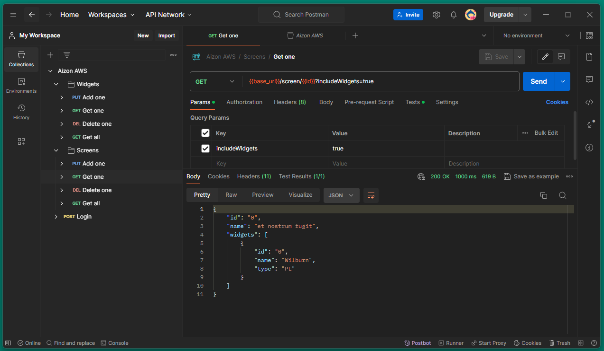

## Aizon Serverless API

Hello! This is a project about serving a Serverless API using AWS CDK with Typescript.

### Try it

The API is deployed on `https://1it5vigk70.execute-api.eu-west-3.amazonaws.com/prod/`, it will be online for a couple of weeks on a free tier account.

There's a Postman collection saved inside `docs` to try it easily. You can find it also [hosted online](https://documenter.getpostman.com/view/34418409/2sA3BobXoW).

### Development

As always, make sure to install dependencies with your package manager. (I use yarn🧶)

The `cdk.json` file tells the CDK Toolkit how to execute your app.

The `bin` folder holds the code that bootstraps the project.

The `lib` folder holds the cloudformation code. Defines all the cloud instances needed on AWS and their behavior.

The `src` folder holds the code that runs on the lambdas.

### Tests

A batch of tests are located inside the `test` folder. They include the most common scenareos for `/login`, `/widget` and `/screen`. Run it through the `test` script from the package file.
